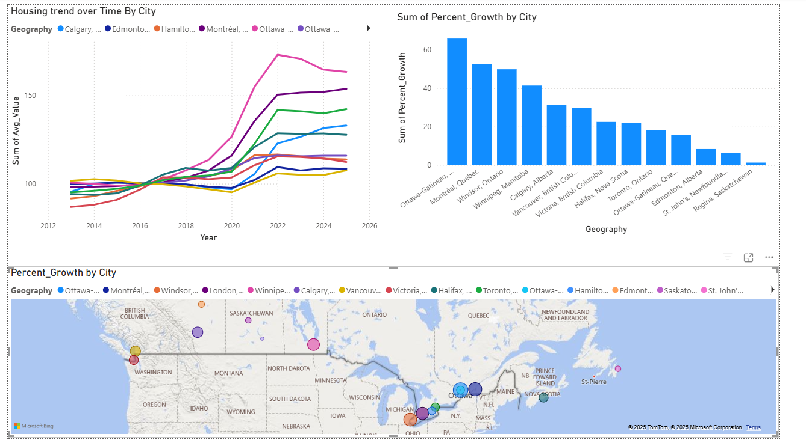
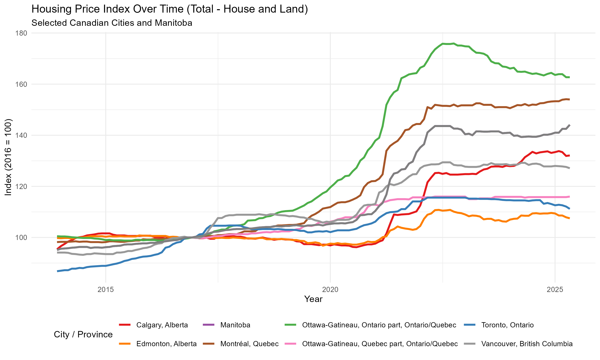

# Canadian Housing Prices Analysis (R + Power BI)

This project explores housing prices across Canadian cities using open datasets, cleaned and analyzed in R, with final visualizations built in Power BI.  
The goal was to understand how prices changed across provinces and what factors might explain those trends.  
With housing affordability becoming a major topic in Canada, this analysis aims to show the story behind the numbers.

---

## 1. Project Overview

- **Goal:** Identify housing price trends and compare major Canadian regions.  
- **Tools:** R (tidyverse, ggplot2), Power BI.  
- **Data:** Open Government of Canada datasets (housing and economic indicators).  

The work is divided into three main stages:  
1. Data cleaning and transformation in R.  
2. Exploratory analysis and visualizations.  
3. Building an interactive Power BI dashboard.

---

## 2. Repository Structure

data/          # Raw and cleaned datasets (.csv)  
scripts/       # R scripts for cleaning, wrangling, and plotting  
output/        # Charts, summaries, and exported Power BI visuals  
images/        # Screenshots for README (added manually)  

---

## 3. Key Insights

- Housing prices have increased steadily in most provinces between 2018 and 2024, with sharper jumps after 2020.  
- Ontario and British Columbia remain the most expensive regions, while Prairie provinces show relative stability.  
- The gap between average housing prices and household income continues to widen, especially in large cities.  

---
## 4. Visuals

### National Overview


---

### Major Cities Trend


---

### City Growth Comparison


---

### Ottawa vs Toronto


---

### Cities Combined Trend


---

More visuals and analysis are available in the Power BI dashboard.

---

## 5. Power BI Dashboard

The interactive dashboard summarizes:  
- National and regional price comparisons  
- Year-over-year percentage changes  
- Income vs affordability metrics  


---

## 6. Next Steps

- Add regression models to test price predictors such as interest rates, income, and population growth.  
- Integrate an affordability index using income data from Statistics Canada.  
- Expand Power BI visuals with slicers by province and housing type.  

---

## 7. How to Run Locally

1. Clone the repository:
   ```bash
   git clone https://github.com/Mahmoud3Ibrahim/canadian-housing-prices-analysis--R-PowerBI-
   cd canadian-housing-prices-analysis--R-PowerBI-
   ```
2. Open `scripts/clean_data.R` in RStudio and run to generate cleaned datasets.  
3. Review charts in the `output/` folder or open the Power BI file to explore the dashboard.

---

## 8. Author

**Mahmoud Ibrahim**  
Ottawa, Canada  
Data Analysis and Web Development  
[LinkedIn](https://www.linkedin.com/in/mahmoud3ibrahim)

---

## 9. License

MIT License
